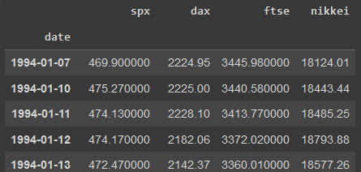
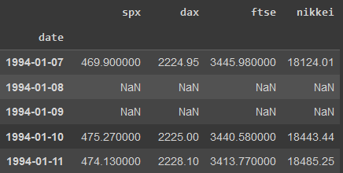
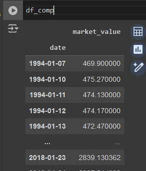
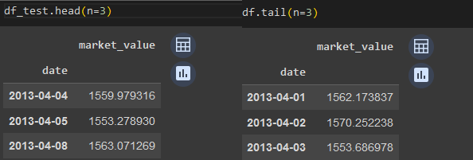

# Series-de-tiempo
Descripcion de lo aprendido en aalisis de series de tiempo


## Métodos en dataframes para manejro en series de tiempo

#### Usar una columna como indice
```
df.set_index('date', inplace=True)
```
* 'date' en este caso es el nombre de la columna a usar como indice
* *inplace=True* nos permite realizar este cambio en el df, de lo contrario solo se genera una copia de un df con el cambio


#### Cambiar un string a date
```
df.to_datetime(df_comp.date, dayfirst=True) 
```
* como primer entrada, el nombre de la columna que sera la fecha, esta debe de tener una estructura de fecha
*  *dayfirst=True*. Por defecto, python considera las fechas en formato mm-dd-yyyy, sin embargo si nosotros tenemos las fechas en español, lo mas probable es que la fecha tega un formato dd-mm-yyyy, con este comando le pasamos la confirmación a Python para que interprete de manera correcta la fecha


**Observacion** Notemos que las fechas  ahora aparecen en formato yyyy-mm-dd, lo cual es mas facil de notar a cuando existe un cambio  de fecha.

#### Frecuencia

Si tenemos observac

```
df.asfrec(freq = 'd')
```
Con que frecuencia se tienen los registros de la serie de tiempo
| Frecuencia | Simbolo |
|------------|---------|
|   hora     |   'h'   |
|   diaria   |   'd'   |
|   semanal  |   'w'   |
|   mensual  |   'm'   |
|   anual    |   'a'   |
|   c/30 seg | '30s'   |
| bussines days | 'b'  |



Aqui se han creado los regostros (filas) restantes. 
#### Inputacion de valores faltantes
En este caso los valores del SP&500 solo trabaja en dias habiles (lunes a viernes con excepcion de dias feriados)
En caso de querer realizar una imputacion de valores faltantes, tenemos el aprametro *, fill_value=*, por ejemplo 
```
df.asfreq(freq='30s', fill_value=9.0)
```
Realizara la imputacion por el valor 9.
Otra manera de realizar la imputacion es mediante el metodo  **fillna()**. Supongamos que queremos realizar la imputacion de una columna llamada spx, entonces se tienen 3 opciones:
| metodo| descipcion| Ejemplo  |
|-------|-----------|----------|
|"ffill"| forward fill, es decir el valor superior mas cercano. Por ejemplo para el 15-05-2024 usara el valor del 16-05-2024| df.spx.fillna(method = "ffill") |
|"bfill"| backward fill. es decir el ultimo valor registrado|df.spx.fillna(method = "bfill") |
|val  | Realiar la imputacion con un valor fijo, ejemplo la media | df.spx.fillna(val = df.spx.mean())

#### Realizar una particion de la serie de tiempo
Supongamos que tenemos un df_comp, el cual  tiene la siguiente estructura.



Y queremos obtener las series al 80% de la longitud, entonces ejecutariamos lo siguiente:

```
#determinar el tamaño de la particion a donde realizar el corte,
size = int(len(df_comp)*0.8) #obtener el valor enter del 80% de la longitud
df = df_comp.iloc[:size] #iloc permite cortar hasta ese valor
df_test = df_comp.iloc[size:]
```
* .iloc[:size] [indiceInicial:indiceFinal], donde por defecto es 0,-1 (el primer y ultimo valor del df original)

Ahora corroboramos que los datos no contienen registros traslapados. esto con los metodos .head() y .tail() al df_test y df, respectivamente.


Notemos que la ultima fecha en el conjunto de entrenamiento (df) es el 03-04-2013, mientras que la primer fecha en el conjunto de prueba (df_test) es el 04-04-2013, es decir el dia siguiente.


